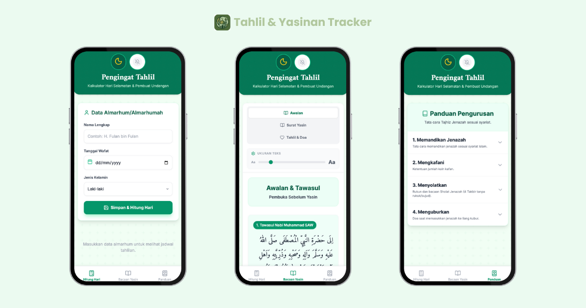

# Tahlil & Yasinan Tracker 🌙



Aplikasi web progresif (PWA) untuk menghitung hari selamatan orang meninggal (tahlilan) dan panduan bacaan Yasin & Tahlil lengkap., serta tata cara pengurusan jenazah.

Aplikasi ini dibangun dengan **React**, **TypeScript**, dan **Vite**, serta mendukung **PWA (Progressive Web App)** sehingga bisa diinstal di HP dan berjalan secara offline.

## ✨ Fitur Utama

1.  **Kalkulator Selamatan Otomatis** 📅
    *   Menghitung jadwal 3, 7, 40, 100 hari, 1 tahun (Mendak), hingga 1000 hari (Nyewu).
    *   Menggunakan perhitungan pasaran Jawa (Legi, Pahing, Pon, Wage, Kliwon).
    *   Perhitungan berbasis "Geblag" (Hari wafat = Hari ke-1).

2.  **Bacaan Yasin & Tahlil Digital** 📖
    *   Surat Yasin lengkap (83 Ayat) dengan audio-friendly layout.
    *   Tahlil lengkap dengan Doa Arwah & Doa Selamat.
    *   **Fitur Khususon**: Nama almarhum otomatis tersisip di dalam doa (misal: *"Khushushon ila ruh..."*).
    *   Pengaturan ukuran teks (Font Size Slider).

3.  **Panduan Pengurusan Jenazah (Tajhiz)** ⚰️
    *   Panduan langkah demi langkah: **Memandikan**, **Mengkafani**, **Menyolatkan**, dan **Menguburkan**.
    *   Lengkap dengan Niat dan Doa dalam Arab, Latin, dan Terjemahan.

4.  **Notifikasi Pengingat** 🔔
    *   Notifikasi lokal browser saat hari selamatan tiba.
    *   Bekerja di HP/Desktop saat aplikasi dibuka.

5.  **PWA Support** 📱
    *   Bisa diinstal di Android/iOS (Add to Home Screen).
    *   Bisa berjalan tanpa koneksi internet (Offline First).

## 🛠️ Teknologi

*   **Frontend**: React 18, TypeScript
*   **Build Tool**: Vite
*   **Styling**: Tailwind CSS
*   **Icon**: Lucide React
*   **PWA**: Vite Plugin PWA
*   **Date Utils**: Custom logic for Gregorian & Hijri/Javanese calculation.

## 🚀 Cara Menjalankan Project

Pastikan sudah terinstall Node.js di komputer Anda.

1.  **Clone Repository**
    ```bash
    git clone https://github.com/jutionck/tahlil-tracker.git
    cd tahlil-tracker
    ```

2.  **Install Dependencies**
    ```bash
    npm install
    ```

3.  **Jalankan Development Server**
    ```bash
    npm run dev
    ```
    Buka `http://localhost:3000` di browser.

4.  **Build untuk Production**
    ```bash
    npm run build
    ```

## 📱 Cara Install di HP (PWA)

1.  Buka website di browser (Chrome/Safari).
2.  Klik tombol "Install Aplikasi" yang muncul di atas, ATAU:
    *   **Android (Chrome)**: Klik menu titik tiga -> "Install app" atau "Add to Home Screen".
    *   **iOS (Safari)**: Klik tombol Share -> "Add to Home Screen".

## 📝 Lisensi

Milik **Jution Candra Kirana**. Dibuat untuk tujuan kemaslahatan umat. Silakan dikembangkan lebih lanjut.

---
*Dibuat dengan ❤️ di Indonesia.*
